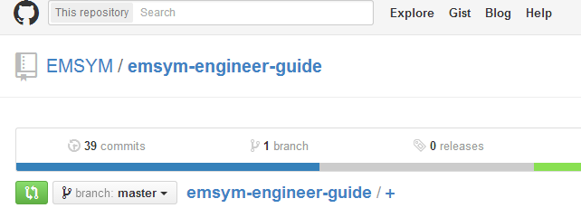
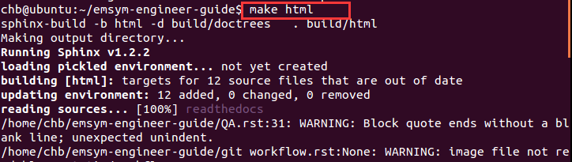

write-doc-in-github
*********************

Sphinx是由python写成的文档编辑工具,语法简洁，方便使用。   

readthedocs.org是一个网站，可以导入Sphinx文档，并且可以与git等代码库关联自动生成文档。
 
 ``[使用方向]`` : ``研发人员所开发的成果，要以文档的形式体现出。``

* 网页文档是基于sphinx工具来做的，所以需要先安装sphinx文档工具，用命令行安装。

* 登陆github的EMSYM页面，网址：https://github.com/emsym

* 找到要写的文档仓库，复制版本库网址。

* 如果文件版本库不在自己的github库中，则需要先fork到自己的github库。
* 在Linux中打开终端，执行git clone下载此版本库到本地。

* 本地目录下就有了此版本库的文件夹。

* 打开文件夹，里面 .rst 就是可以打开编辑的文件。

* sphinx语法特列

* 新建文档:
* 在 index.rst 文件中的主标题之后，有一个内容清单，其中包括 toctree 声明。toctree 是将所有文档汇集到文档中的中心元素。如果有其他文件存在，但没有将它们列在此指令下，那么在构建的时候，这些文件不会随文档一起生成。
* 我们想将一个新文件添加到文档中，并打算将其命名为 blog.rst。还需要将它列在 toctree 中，但要谨慎操作。文件名后面需要有一个间隔，这样文件名清单才会有效，该文件不需要文件扩展名（在本例中为 .rst）。在文件名距离左边距有三个空格的距离，maxdepth 选项后面有一个空白行。

* 在blog.rst文件中添加内容，现在我们准备生成输出。
* 运行 make 命运，并将 HTML 指定为输出格式。可直接将该输出用作网站，因为它包含了生成的所有内容，包括 JavaScript 和 CSS 文件。

写好后提交代码，github会自动生成网页文档。

